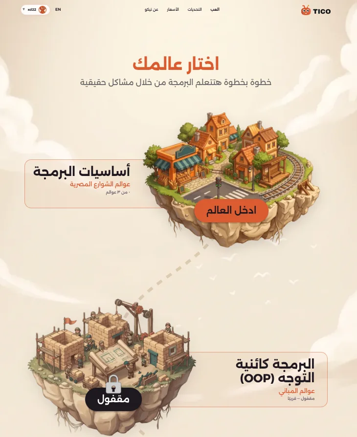
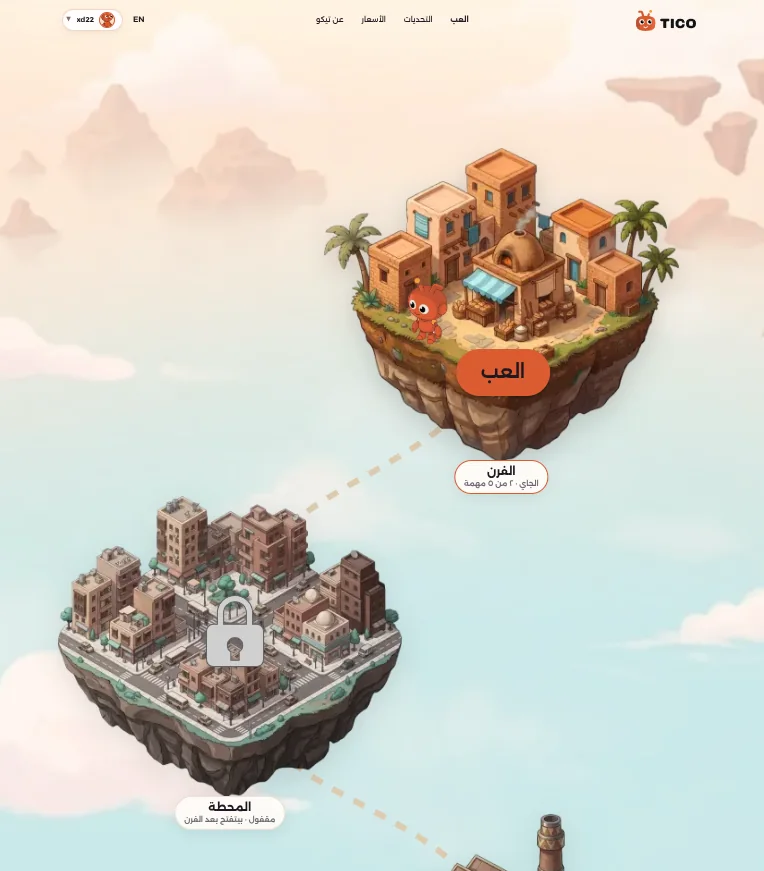
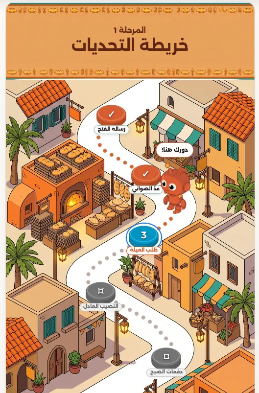
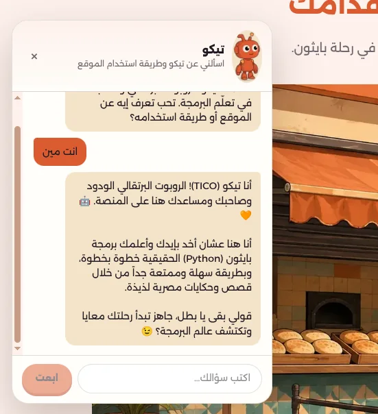
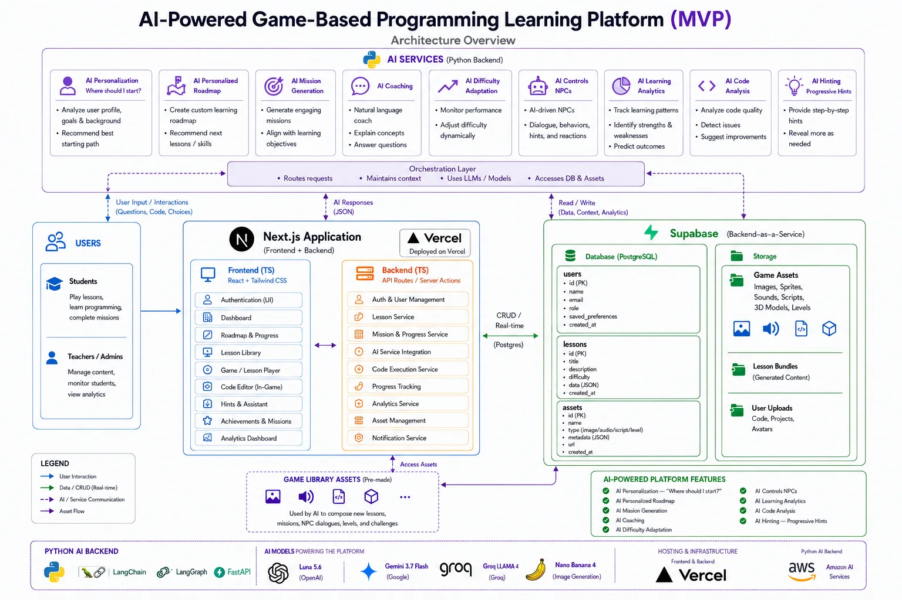
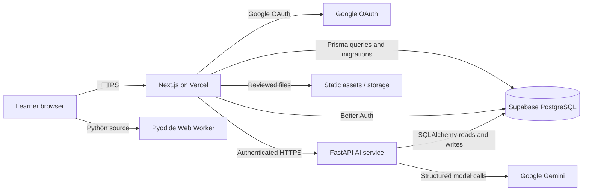
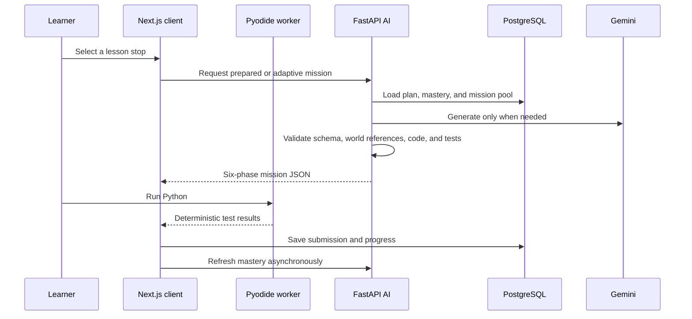
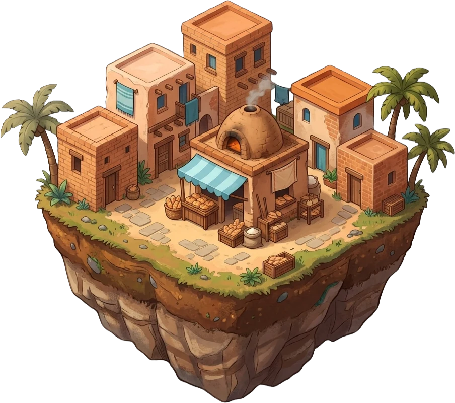
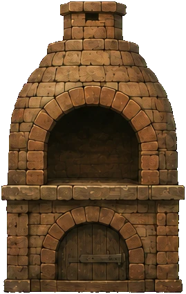

<p align="center"></p>

<h1 align="center">TICO: Learn Python by helping Egypt</h1>

<p align="center"><strong>Built by Team SONIC</strong></p>

<p align="center">
  <a href=".github/workflows/ci.yml"></a>
  <a href="https://tico.0xd22.dev"></a>
  <a href="https://54-75-53-43.sslip.io/docs"></a>
  
  
  
</p>

<p align="center">
  <a href="#live-demos">Live demos</a> ·
  <a href="#screenshots">Screenshots</a> ·
  <a href="#what-you-can-do-today">Features</a> ·
  <a href="#gameplay-and-learning-design">Gameplay</a> ·
  <a href="#architecture">Architecture</a> ·
  <a href="#ai-services">AI</a> ·
  <a href="#art-and-assets">Assets</a> ·
  <a href="#local-development">Run locally</a> ·
  <a href="#team-sonic">Team</a>
</p>

TICO is a bilingual, story-driven programming game for children and beginner university students. Learners write real Python to help characters solve everyday Egyptian problems: opening a neighborhood bakery, serving a queue, organizing railway journeys, and coordinating Cairo traffic.

Every coding action produces a visible consequence in the world. A variable can open the shop or prepare several trays; an `if` condition can decide who receives bread; a wrong quantity can leave a customer waiting. TICO, the orange robot companion, explains programming from zero and provides a four-step hint ladder without giving away complete solutions.

> **Languages:** Egyptian Arabic (`ar-EG`, the default) and English (`en`). Interface text follows the selected direction while Python code and output remain left-to-right.

## Live demos

| Service | URL | Purpose |
| --- | --- | --- |
| Client | [tico.0xd22.dev](https://tico.0xd22.dev) | Next.js game, maps, missions, and learner dashboard |
| AI API | [54-75-53-43.sslip.io/docs](https://54-75-53-43.sslip.io/docs) | Interactive FastAPI / Swagger documentation |
| AI health | [54-75-53-43.sslip.io/v1/health](https://54-75-53-43.sslip.io/v1/health) | Process and database readiness |

The client and AI health URLs were verified on 15 September 2026. Sign in with Google, or use the guest button to play without an account.

## Screenshots

### Landing page

TICO greets the learner in Egyptian Arabic and invites them straight into the game.


### Interactive bakery mission

The El Forn bakery is a place the learner stands in. The code panel sits over the live scene; the HUD tracks takings (`الفلوس`) and oven temperature, and every run changes what the shop, the baker, and the queue do next.


### From chapter to world to mission

<table>
  <tr>
    <th>Chapters map</th>
    <th>Worlds map</th>
    <th>Challenge map</th>
  </tr>
  <tr>
    <td></td>
    <td></td>
    <td></td>
  </tr>
  <tr>
    <td>Pick a chapter. Programming basics is open; OOP, data structures, and algorithms are drawn and waiting.</td>
    <td>Each chapter is a set of Egyptian worlds. El Forn (the bakery) opens first, then El Mahatta (the station) and Isharet Cairo (traffic).</td>
    <td>Inside a world, TICO walks the learner down the road from one authored mission to the next.</td>
  </tr>
</table>

### TICO, the companion

<table>
  <tr>
    <th>Page-aware chat</th>
    <th>Learner analysis dashboard</th>
  </tr>
  <tr>
    <td width="34%"></td>
    <td width="66%"></td>
  </tr>
  <tr>
    <td>TICO answers questions about the site and the current mission in Egyptian Arabic, streamed over SSE, with a moderation gate in front of every prompt.</td>
    <td>Attempts, passes, corrected mistakes, and finished concepts, introduced by a spotlight tour the first time the page opens.</td>
  </tr>
</table>

## Gameplay and learning design

Each mission follows six authored learning phases while the setting, cast, and props provide variety:

1. **Encounter** — a character introduces a concrete problem in the scene.
2. **Explore** — the learner predicts what should happen.
3. **Discover** — TICO introduces the Python concept in plain language.
4. **Understand** — the learner runs and reads a complete example.
5. **Guided coding** — two or more small coding steps change the world.
6. **Remix** — a new requirement asks the learner to adapt their code.

The current authored El Forn path contains two variable missions and two conditional missions: `رسالة الفتح` (Opening Message), `عدّ الصواني` (Count the Trays), `طلب العيلة` (Family Order), and `النصيب العادل` (Fair Share). Each includes multiple scene interactions and three meaningful gameplay beats. The mechanic is deliberately scoped to variables, conditionals, and loops.

The design principle behind every mission, learned from documented model failures, is **author the beats, generate the dressing**: anything the learner must not get wrong is written by a person; the model varies the cast, props, and prose around it.

Python runs locally in a sandboxed Pyodide Web Worker. This gives immediate feedback and keeps untrusted learner code away from the Next.js and AI servers. AI output never decides whether code passed: deterministic tests, schemas, manifests, and progression rules make that decision.

## Technology stack

| Layer | Technology |
| --- | --- |
| Web application | Next.js 16 App Router, React 19, TypeScript 5 |
| UI and motion | Tailwind CSS 4, CSS Modules, Motion for React |
| Code editor | CodeMirror 6 with Python language support |
| Browser execution | Pyodide in a dedicated Web Worker |
| Authentication | Better Auth with Google OAuth, guest sessions, and opaque session tokens |
| Application data | PostgreSQL on Supabase, Prisma ORM and migrations |
| AI service | Python 3.11+, FastAPI, Pydantic 2 |
| AI orchestration | LangChain, LangGraph, Google Gemini |
| AI data access | SQLAlchemy 2 with psycopg2; Prisma remains migration owner |
| Validation and tests | Node test runner, Pytest, Playwright, ESLint |
| Deployment | Vercel client, Supabase database/storage, AWS EC2 AI service behind Nginx and Gunicorn/Uvicorn |

## Repository structure

```text
TICO/
├── client/
│   ├── prisma/                    # Authoritative schema and migrations
│   ├── public/
│   │   ├── assets/                # Reviewed runtime scenes, props, sprites, audio
│   │   └── pyodide-worker.js      # Isolated Python execution worker
│   ├── scripts/                   # Mission import, asset preparation, narration, screenshots
│   └── src/
│       ├── app/                   # App Router pages and route handlers
│       ├── components/
│       │   ├── analysis/          # Learner progress dashboard and TICO dock
│       │   ├── bakery/            # Layered bakery renderer and simulation
│       │   ├── mission-player/    # Six-phase coding experience
│       │   └── mission-ui/        # Chapter, world, and challenge maps
│       ├── lib/                   # Auth, runner, AI types, manifests
│       └── services/              # Server-side application services
├── ai-backend/
│   ├── app/
│   │   ├── ai/                    # Model router, prompts, guards, graphs
│   │   ├── api/v1/                # FastAPI routers
│   │   ├── manifests/             # Versioned world vocabulary loader
│   │   ├── models_tables/         # SQLAlchemy mappings to Prisma tables
│   │   ├── queries/               # Database access
│   │   ├── rules/                 # Deterministic pedagogy and progression
│   │   ├── schemas/               # Pydantic/OpenAPI contracts
│   │   └── services/              # AI use-case orchestration
│   ├── content/
│   │   ├── prebuilt/              # Reviewed authored missions
│   │   └── worlds/                # Closed world manifests
│   ├── deploy/                    # EC2, Nginx, systemd, Docker guidance
│   ├── evals/                     # Model-quality evals run in CI
│   ├── scripts/                   # Contract generation and validation
│   └── tests/
├── docs/                          # Product, architecture, UX, safety, and art docs
├── .github/workflows/ci.yml       # Migration, contract, backend, and client gates
├── AGENTS.md                      # Repository-wide contribution rules
└── pnpm-workspace.yaml
```

## Architecture

### Product architecture overview



This illustration presents the broader MVP product concept. The diagram below describes the current implemented service boundaries and is the technical reference for this repository.

### Implemented service architecture



The boundaries are deliberate:

- **The client owns gameplay.** It renders scenes, runs learner Python, records submissions, updates progress, and owns every database migration.
- **The AI backend returns decisions and prose.** It never renders game state, executes learner code, or changes the schema.
- **Prisma is the database authority.** SQLAlchemy maps the same tables for AI use cases but does not create or migrate them.
- **OpenAPI is the HTTP authority.** TypeScript AI types are generated from FastAPI and checked for drift.
- **World manifests constrain generation.** Models select from approved characters, props, actions, and mechanics instead of inventing runtime APIs.

### Mission request flow



## AI services

TICO uses one companion persona and six bounded AI capabilities:

| Capability | Deterministic layer | Model contribution |
| --- | --- | --- |
| Hints and TICO chat | Chooses context, hint rung, safety limits, and cache key | Writes short Socratic guidance |
| Error analysis | Normalizes runner evidence and restricts categories | Classifies ambiguous failures |
| Student model | Computes weighted mastery from evidence | Optional summary only |
| Path planner | Produces required and optional lesson choices | Reviews conflicting evidence |
| Adaptive composer | Selects scaffold, repetition, and advance/hold rules | Reviews uncertain conflicts |
| Mission generation | Narrows the legal curriculum and scene vocabulary, then validates code | Composes a structured mission draft |

Every structured model result is parsed through Pydantic. Generated missions must pass schema validation, manifest-reference checks, concept-scope checks, localization and safety checks, and executable solution tests. A failed generation retries once, then falls back to reviewed content. Mastery and pass/fail results never come from a language model.

The four-rung hint ladder gradually moves from attention guidance to a verbal repair explanation. Even its final rung does not return a complete runnable answer, and a leak test in CI checks that it stays that way.

TICO chat runs as a LangGraph graph with an input moderation gate before any prompt and an output-leak retry after it. Since [ADR 0004](docs/decisions/0004-page-aware-tico-chat.md) the chat knows which page the learner is on, so it can explain the site as well as the mission.

## AI API endpoints

All application routes use the `/v1` prefix. Protected routes validate Better Auth bearer sessions against the shared database. Successful JSON responses use a `{ data, meta }` envelope; errors use a stable `{ error }` envelope. TICO chat streams server-sent events.

| Method | Endpoint | Responsibility |
| --- | --- | --- |
| `GET` | `/v1/health` | Process and database health |
| `POST` | `/v1/sessions` | Open a mission session |
| `PATCH` | `/v1/sessions/{session_id}/phase` | Advance the recorded mission phase |
| `POST` | `/v1/sessions/{session_id}/close` | Close a mission session |
| `POST` | `/v1/sessions/{session_id}/debrief` | Produce the end-of-mission debrief |
| `POST` | `/v1/hints` | Return the next bounded hint rung |
| `POST` | `/v1/submissions/analyze` | Classify normalized execution failures |
| `POST` | `/v1/students/{student_id}/refresh` | Recompute deterministic mastery |
| `POST` | `/v1/students/{student_id}/plan` | Build the learner's next lesson path |
| `POST` | `/v1/missions/next` | Select or generate the next six-phase mission |
| `POST` | `/v1/missions/by-lesson` | Resolve the mission behind a specific map stop |
| `GET` | `/v1/missions/{mission_id}` | Reload a validated stored mission |
| `POST` | `/v1/missions/generate` | Explicitly generate and validate a mission |
| `POST` | `/v1/challenges/next` | Build mixed practice from mastered concepts |
| `POST` | `/v1/tico/messages` | Stream mission-scoped TICO chat over SSE |

The executable contract is available from [`/openapi.json`](https://54-75-53-43.sslip.io/openapi.json), with Swagger at the live AI demo linked above.

## Art and assets

TICO uses a warm, hand-painted 2D storybook style grounded in contemporary everyday Egypt. Production rules avoid readable generated text, brands, official emblems, stereotypes, and unrelated tourist motifs. Characters and props are generated as isolated transparent layers, reviewed by a person, optimized to WebP, and registered in a closed manifest before code can reference them.

<p align="center">
  
  
  
  
  
  
</p>
<p align="center">
  
  
  
  
  
  
</p>

The bakery is composed in a shared 1600×900 SVG coordinate system. Environment layers, fixtures, actors, props, bread ownership, queue state, delivery state, money, and animation beats remain independent, so code can change one part of the scene while the rest stays stable. The cast are walk-cycle sheets cut into frames at runtime, and `bread-board` (one burnt loaf beside two good ones) is the asset for "an unattended oven burns the bread".

### Asset workflow

1. Write a versioned prompt from the [asset bible](docs/09-asset-bible-and-image-prompts.md).
2. Generate a master scene, character atlas, or isolated prop.
3. Review cultural fit, anatomy, transparency, crop safety, and small-size readability.
4. Cut sprite sheets by connected components with `client/scripts/cut-sprite-sheet.py` when needed.
5. Export optimized WebP runtime assets.
6. Add stable IDs to both the AI world manifest and the client scene manifest, in the same change.
7. Run asset-budget, placement, overlap, interaction, and browser-playthrough checks.

See [layered bakery production](docs/13-bakery-layered-production.md) and the prompt collections under `docs/*.json` for reproducible examples.

## Local development

### Requirements

- Node.js 22 and pnpm 10.28+ (CI pins 10.28.2)
- Python 3.11+
- PostgreSQL/Supabase credentials
- Google OAuth credentials for sign-in (guest sign-in works without them)
- Google Gemini API key for live AI features (missions still play from authored fallbacks without it)
- ElevenLabsAI API key for narration

### Client

```bash
cd client
pnpm install
cp .env.example .env        # Windows: copy .env.example .env
pnpm db:generate
pnpm db:deploy
pnpm db:seed
pnpm dev
```

Open `http://localhost:3000`. Use `pnpm test`, `pnpm typecheck`, and `pnpm lint` for validation. Run all Prisma commands from `client/`; never run `prisma migrate reset` against the shared database.

### AI backend

```bash
cd ai-backend
python -m venv env
# Windows: env\Scripts\activate
# macOS/Linux: source env/bin/activate
pip install -r requirements.txt
cp .env.example .env        # Windows: copy .env.example .env
uvicorn app.main:app --reload --port 8000
```

Open `http://localhost:8000/docs` for Swagger or `http://localhost:8000/v1/health` for readiness. Run `pytest tests` and `pytest evals` from `ai-backend/`; both are offline by default.

### Contract checks

After changing a Pydantic API schema, regenerate and verify the client types:

```bash
python ai-backend/scripts/gen_client_types.py
python ai-backend/scripts/gen_client_types.py --check
```

Database changes begin in `client/prisma/schema.prisma`, include a Prisma migration in the same commit, and then update matching SQLAlchemy models. `client/src/lib/ai/types.ts` is generated; never edit it by hand.

## Quality gates

[`ci.yml`](.github/workflows/ci.yml) runs three jobs on every push and pull request. Each guard exists because the failure it catches already happened once.

| Job | What it proves |
| --- | --- |
| **Migrations build the schema** | Every Prisma migration applies to an empty Postgres 17, `schema.prisma` and the migration history agree, and every SQLAlchemy model matches the migrated database. |
| **AI backend** | Pytest suites, the model-quality evals, and a check that the generated TypeScript types are not stale. |
| **Client** | Typecheck, lint, and the Node test runner, including the tests that pin the browser runner's pass/fail comparison to the server sandbox. |

## Documentation

The [documentation map](docs/README.md) links the detailed specifications. The ones most people need first:

| Document | Read it for |
| --- | --- |
| [01 — Product and game design](docs/01-product-and-game-design.md) | Audience, game loop, progression |
| [02 — Python curriculum](docs/02-python-curriculum.md) | Concept sequence and the 18-mission matrix |
| [03 — Egypt world bibles](docs/03-egypt-world-bibles.md) | Characters, scenes, cultural constraints |
| [05 — System architecture](docs/05-system-architecture.md) | Service ownership and trust boundaries |
| [06 — Data model and contracts](docs/06-data-model-and-contracts.md) | The HTTP envelope and error shape |
| [07 — Browser Python runner](docs/07-browser-python-runner.md) | Pyodide worker protocol and limits |
| [08 — AI and adaptation](docs/08-ai-generation-and-companion.md) | The six AI capabilities and constrained generation |
| [09 — Asset bible](docs/09-asset-bible-and-image-prompts.md) | Art direction and production prompts |
| [13 — Layered bakery production](docs/13-bakery-layered-production.md) | How the bakery scene is composited |
| [14 — Interactive missions](docs/14-interactive-missions.md) | The architecture behind missions that act on the world |
| [15 — Mission authoring](docs/15-mission-authoring.md) | How to write a new mission, start to finish |
| [Design system](docs/design.md) | Tokens, components, motion, and reduced-motion rules |
| [Decisions](docs/decisions/) | ADRs: MVP baseline, the TICO mascot, Google sign-in, page-aware chat |

Before contributing, read [`AGENTS.md`](AGENTS.md) and the nested [`client/AGENTS.md`](client/AGENTS.md) and [`ai-backend/AGENTS.md`](ai-backend/AGENTS.md). The project uses `pnpm` for the client and keeps Python dependencies inside `ai-backend/`.

## Team SONIC

<table>
  <tr>
    <td align="center"><a href="https://github.com/Justxd22"><br /><sub><b>Justxd22</b></sub></a></td>
    <td align="center"><a href="https://github.com/AhmedMostafaDev12"><br /><sub><b>Ahmed Mostafa</b></sub></a></td>
    <td align="center"><a href="https://github.com/Ahmed-Ads"><br /><sub><b>Ahmed-Ads</b></sub></a></td>
    <td align="center"><a href="https://github.com/Adhamalkhateeb"><br /><sub><b>Adhamalkhateeb</b></sub></a></td>
  </tr>
  <tr>
    <td align="center"><sub>Client, maps and bakery scene, art pipeline, narration, deployment</sub></td>
    <td align="center"><sub>Interactive missions, authored El Forn path, analysis dashboard, CI and AI deploy</sub></td>
    <td align="center"><sub>Hint ladder, error classification, mission-generation guards, TICO chat graph, evals</sub></td>
    <td align="center"><sub>Initial AI backend: sessions, submissions, learning paths, auth provisioning</sub></td>
  </tr>
</table>
