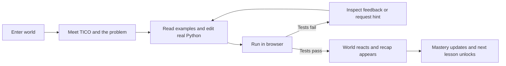

# Product and game design

## Product promise

TICO helps a learner move from “I can follow Python” to “I can use Python to solve a problem.” Every lesson places real syntax inside a contemporary Egyptian situation, gives immediate executable feedback, and ends with a visible improvement to the world.

The launch experience is not a generic coding editor with Egyptian decoration. The story problem, data, objects, dialogue, soundscape, and visual feedback all arise from everyday Egypt.

## Audience and modes

The same Python semantics and tests support two presentation modes:

| Dimension | Young learner | Undergraduate |
| --- | --- | --- |
| Language | Short sentences, concrete verbs | Concise technical vocabulary |
| Story | Character-led and encouraging | Operational context and trade-offs |
| Starter code | More scaffolding | Less scaffolding |
| Examples | One worked analogy | Inputs, constraints, edge cases |
| Extension | Optional playful variation | Optional efficiency or robustness task |

Mode changes presentation and scaffolding, not correctness. A learner can switch mode without losing progress.

We collect a coarse age band, never exact date of birth: `UNDER_13`, `TEEN`, or `ADULT`. Under-13 behavior is described in the safety document.

## Core loop

Each mission contains:

1. A short opening scene.
2. A concrete problem and one primary coding challenge.
3. Starter code, visible examples, and formative hidden tests.
4. Four progressive hint rungs, with static reviewed hints for under-13 learners.
5. Failure feedback tied to observable test results.
6. A success scene, concept recap, and optional extension.

## Progression

- The fixed concept order is variables → conditionals → loops → functions, with supporting data structures introduced at approved points.
- A diagnostic marks eligible lessons `required` or `optional`. Optional means skippable, never inaccessible.
- Unlocks follow curriculum order and required concept gates, not XP.
- First completion grants 100 XP. An optional extension grants 25 XP once.
- Hints do not reduce XP. Attempts are unlimited.
- Every completed or skipped lesson remains replayable.
- After the roadmap, the challenge arena mixes already-mastered concepts without starter scaffolding.

## Adaptive behavior

Adaptation has exactly three levers inside a lesson:

1. How much carried-concept code is pre-scaffolded.
2. How many practice repetitions are required.
3. Whether the learner advances or holds at the concept gate.

Pure Python rules propose all learner-impacting decisions and attach a confidence. A model reviews only conflicting evidence. Each decision stores `decided_by` and a human-readable `reason`. Mastery numbers are always deterministic.

## Tone and rewards

TICO is warm, curious, specific, and never patronizing. Feedback describes what the program did before suggesting what to inspect. Failure is framed as useful evidence.

Rewards are mastery-oriented: repaired scenes, stamps, world badges, a personal journey map, and XP. The MVP excludes lives, streak punishment, public rankings, public chat, multiplayer, loot boxes, advertisements, and pay-to-progress.

## Success measures

- Activation: account created and first code run within one session.
- Learning: first-pass vs eventual completion by concept and mode.
- Persistence: return to the next required lesson within seven days.
- Help quality: hint rung requested, subsequent attempt result, and learner rating.
- Reliability: runner startup, run, and AI response success rates.
- Safety: answer-leak, unsafe-content, privacy, and unauthorized-access incidents.

Metrics must be segmented by age band and locale without exposing an individual child in low-volume reports.

## Non-goals for MVP

- A general-purpose IDE or arbitrary package installation.
- Competitive grading, certification, or high-stakes exams.
- A free-form AI friend outside lesson context.
- User-generated public worlds or social features.
- Historically themed or tourism-first representations of Egypt.
