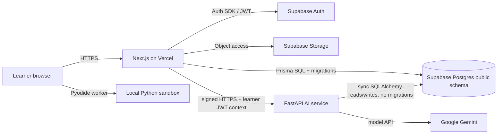

# System architecture

## System context

## Ownership

### Next.js client/backend

`client/` owns pages, React UI, Supabase browser/server auth integration, authorization for game actions, all Prisma models and migrations in the shared `public` schema, learner progress, content publication UI, asset delivery, browser-runner integration, and the BFF boundary presented to browsers.

Use Server Components for reads and Server Actions for authenticated mutations. Route Handlers are reserved for auth callbacks, streaming proxy endpoints, webhooks, and service callbacks.

### Python AI service

`ai-backend/` owns six capabilities: TICO conversation/hints, failure classification, deterministic mastery, path planning, adaptive composition, and constrained mission generation. It returns JSON decisions and prose; it never renders game state or executes learner code.

Its dependency direction is `api → services → domain / repositories / ai`. Routers contain no SQLAlchemy queries. `domain/` has no model or database imports. Every model call passes through `app/ai/router.py` and returns a Pydantic v2 model.

The service owns no database migrations. It maps the Prisma-owned tables in the shared `public` schema with synchronous SQLAlchemy and may read or write only the rows required by its use cases. It must not add Alembic or issue schema-changing SQL. Prisma model and migration changes happen in `client/` first; matching SQLAlchemy mappings are then updated and contract-tested.

## Authentication and authorization

Supabase Auth provides conventional email/password registration, email verification, password reset, and Google OAuth. There is no anonymous account path. The browser receives normal Supabase session tokens; server code verifies the user and maps the Supabase subject to the application profile.

The FastAPI service verifies the Supabase access JWT and independently checks that path/body user IDs match the token subject. Internal callbacks additionally use a timestamped HMAC signature and idempotency key. Never expose a service-role key to the browser.

Roles are `STUDENT`, `TEACHER`, and `ADMIN`. Role checks occur server-side at each data access or mutation, not just in navigation.

## Key request flows

### Run and complete a mission

1. The browser loads the published mission, asset references, and starter variant from Next.js.
2. A dedicated Web Worker executes Python and formative tests locally.
3. The browser posts code, normalized result, timing, and mission version to a Server Action.
4. Next.js revalidates shape, identity, version, and idempotency key.
5. A Prisma transaction creates the submission and, on first pass, updates progress and XP.
6. Next.js asks FastAPI to refresh mastery asynchronously. Failure here never rolls back an accepted completion.

### Generate a mission

1. Staff requests generation for a lesson and world manifest version.
2. FastAPI's rules narrow legal scenes, characters, props, mechanics, and scaffold level.
3. The model composes a structured draft from that closed set.
4. Pydantic, manifest-reference, localization, solution/test, and answer-leak validators run.
5. After two rejected generations, use the reviewed template default and record the fallback.
6. A validated draft enters review; only a teacher/admin can publish it.

### Stream TICO chat

1. Next.js authenticates and rate-limits the learner.
2. It loads the mission context and strips account PII.
3. FastAPI fixes the allowed capability and hint rung before any model call.
4. The model response streams as server-sent events through Next.js.
5. Completed messages and safety metadata persist; partial abandoned responses do not.

## Deployment

- Vercel deploys `client/` and runs server-side Prisma access.
- Supabase hosts PostgreSQL, Auth, and Storage. Runtime database traffic uses the pooler appropriate to each client; Prisma migrations use a direct/session connection.
- AWS EC2 is the AI production baseline: Nginx → Gunicorn with Uvicorn workers under systemd. A Docker image keeps Render deployment viable.
- Static Pyodide assets are pinned and served from the application/CDN with integrity and cache headers.

## Reliability and fallback

- The coding runner remains useful when AI is unavailable.
- Reviewed template missions and static hints are mandatory fallbacks.
- All cross-service mutations carry an idempotency key and explicit timeout.
- AI refresh jobs may retry with bounded exponential backoff and a dead-letter state.
- Client-facing requests never wait for nonessential analytics or mastery refreshes.
- Health endpoints distinguish process health, dependency readiness, and model-provider degradation.

## Trust boundaries

Student code is hostile input and remains in the browser worker. Model output is untrusted content and must pass schema and semantic validators. JWT claims are verified, not decoded and trusted. Asset IDs are allowlisted through manifests. Browser-reported test results are treated as formative evidence, never high-stakes proof.
