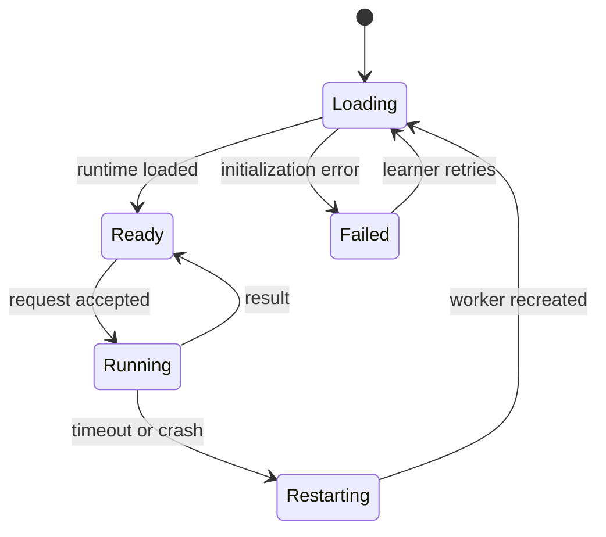

# Browser Python runner

## Goal and non-goal

Run beginner Python quickly without sending source code to an execution server. The runner is a formative sandbox, not a hardened judge for credentials or competition.

## Architecture

Pyodide runs only inside a dedicated module Web Worker. The React client owns editor state and communicates through the versioned `RunnerRequest`/`RunnerResult` messages. Neither Pyodide nor learner code executes on the main UI thread.

Pin the Pyodide version and self-host its distribution or use an explicitly approved CDN with strict versioning. Cache runtime files in the browser, show first-load progress, and recreate a failed worker without losing editor content.

## Execution modes

### `SCRIPT_STDIN`

Each case provides stdin text and expected stdout. The harness replaces stdin, captures stdout/stderr, executes the source in a fresh globals dictionary, normalizes line endings and one trailing newline according to the case policy, then compares output.

### `FUNCTION_CALL`

The source is executed once in fresh globals. Each case names an allowlisted function and JSON-compatible arguments. The harness calls it and compares the returned JSON-compatible value. Private attribute access and dynamic function names are rejected.

## Limits

- Default wall-clock limit: 3,000 ms per run, including all cases.
- Output cap: 65,536 UTF-8 bytes across stdout and stderr.
- Maximum source size: 64 KiB.
- Maximum test cases: 30.
- No package installation, network calls, DOM access, local files, subprocesses, or persistence between runs.
- Permit only curriculum-approved standard-library modules. Audit the allowlist before expanding it.

A browser worker cannot safely interrupt arbitrary synchronous Python. On timeout, terminate the entire worker, report `TIMEOUT`, start a fresh worker, and lazily reload Pyodide.

## Harness safeguards

- Validate message origin by owning worker instance and parse every payload.
- Generate harness data with JSON serialization; never interpolate learner text into Python source.
- Use fresh globals and reset stdin/stdout/stderr for every run.
- Replace `__import__` with an allowlist guard and reject known dangerous modules.
- Limit exception text and strip harness internals from learner-facing traces.
- Keep full reference solutions out of the browser bundle where practical; accept that formative hidden cases remain discoverable.
- Apply a restrictive Content Security Policy. Pyodide's WebAssembly requirements must be tested against the exact production headers.

Pyodide is not a perfect security boundary. The crucial protections are browser isolation, no privileged data in the worker, no server credentials, no network capability granted by the application, and worker destruction.

## Result semantics

Case comparison supports exact text, normalized text, scalar equality, list/dictionary equality, and optional numeric tolerance. Every case result includes a safe label, status, duration, and sanitized expected/actual values when visible. Hidden cases expose only a misconception-oriented feedback key.

The UI distinguishes:

- Python syntax/runtime errors;
- timeout;
- wrong output;
- failed assertion;
- runner initialization or protocol failure.

## Lifecycle

Only one request runs per worker. A newer run may cancel an older one by terminating the worker. Results with stale `requestId` values are ignored.

## Test plan

Unit-test normalization, comparisons, output truncation, imports, serialization, and error sanitization. Integration-test worker startup and both modes in Chromium, Firefox, and WebKit. Required adversarial cases include infinite loops, output floods, recursive exhaustion, forbidden imports, malformed worker messages, Unicode Arabic output, and rapid cancel/restart.
