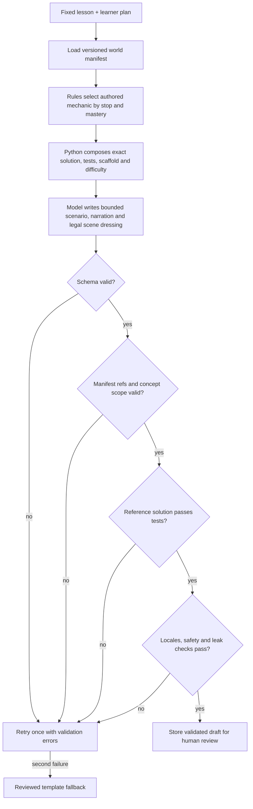

# AI generation, adaptation, and TICO

## Principle

The server narrows; the model chooses. Code defines a closed set of legal educational and world options. A model may select among those options and write bounded prose, but never decides mastery scores or invents game APIs.

## Six capabilities

| Capability | Deterministic responsibility | Model responsibility |
| --- | --- | --- |
| TICO hints/chat | select context, rung, limits, cache key, safety policy | write bounded Socratic prose |
| Error analysis | normalize execution evidence, fixed category set | classify ambiguous failures |
| Student model | calculate weighted mastery | none; optional summary only |
| Path planner | propose required/optional lessons with confidence | review conflicting evidence |
| Adaptive composer | select scaffold, repetitions, advance/hold | review conflicts only |
| Mission generation | narrow manifest and curriculum choices; validate output | compose structured scenario |

There is one TICO persona. Do not create separate NPC chat agents.

## Model routing

All calls use `app/ai/router.py`; no inline model IDs. Configuration initially routes high-volume hints/reactions and classification to a stable low-latency Gemini Flash Lite class model, and mission generation, conflict review, and chat to a stable Gemini Flash class model. Exact supported IDs are environment configuration and must be verified before deployment. Avoid preview and scheduled-for-retirement IDs.

Every call returns a Pydantic v2 model where structured output is expected and logs capability, model, prompt version, input/output tokens, estimated cost, latency, cache result, safety outcome, trace ID, and failure type to `ai_interaction`.

## Mission generation pipeline

Mission generation is selection from a closed manifest, not open-ended world building. Unknown IDs, reads, verbs, concepts, or mechanics are fatal validation errors. No generated mission is directly published.

The model does not invent the phase-4/5 algorithm. The selected manifest mechanic fixes
the signature, reference solution, derived tests and difficulty band. A mechanic may also
fix the remix algorithm when the physical meaning must not drift; the model then narrates
that authored change. Mastery affects which stop the learner is on and how carried
concepts are scaffolded, while the target concept is never scaffolded away.

New drafts also pass a gameplay-quality fence. A renderer may expose a smaller set of
`interactive_targets` than the sprites it can draw. Every requested click must use one of
those real hit targets, play narrated visual beats, and continue the same scene state.
Generated lessons require two reasoning rounds, two coding steps that grow from one blank
to at least two, a visible consequence after every code run, and an AST check proving the
code actually contains the target construct (`if`, loop, assignment or function).
The first traffic-loop generator narrows the model further: reviewed gameplay owns the
clicks, car movement, pedestrian crossing, top-level Python, tests, and remix. The model
sees an authored El Forn mission as a narration reference and writes only short
Egyptian-Arabic story fields. The first Isharet Cairo map stop generates a car-loop
mission; the second generates a pedestrian-loop mission. The learner completes `for`
to count safe crossings, then extends the same loop from two people to four. The returning
group appears on the pavement immediately; later code runs do not reintroduce cars that
already left. Both stops have reviewed six-phase missions as fallbacks. Traffic live
generation uses `TRAFFIC_LIVE_MISSION_GENERATION`, independently of the global flag.
The Isharet Cairo world labels itself as beta. Its experimental button requests a fresh
server-generated pedestrian mission; it never opens the saved review sample or silently
substitutes a prepared mission. The ordinary map stops still use the reviewed missions
when generation is unavailable, and completing a stop returns to that world's map.
Functions are reserved for their own lesson.

## Four-rung hint ladder

The server counts prior hint events and fixes the rung before generation:

| Rung | Purpose | Disclosure limit |
| ---: | --- | --- |
| 1 | Orient attention | no diagnosis or solution identifier |
| 2 | Ask a guiding question | no solution content |
| 3 | Name the concept and show a different example | no target values or mission identifiers |
| 4 | Walk toward the repair in words | precise idea, never a complete runnable line |

After rung four, route the learner to a short practice on that idea, then return to the mission. Automated leak tests are rung-specific. Under-13 learners receive equivalent reviewed static hints, not live generated prose, until the organization has approved provider data controls.

## Conversation boundaries

TICO may discuss the current website page, platform navigation and learning design, the
analysis dashboard and its recorded metrics, the active mission, prerequisite concepts,
execution results, and encouragement related to learning. On landing and analysis pages,
page context takes precedence; owned mission background is loaded only for explicit
mission questions. Page chat does not require a mission session. It remains bounded to
the platform and learning, rather than becoming a general-purpose personal chatbot.
See [ADR 0004](decisions/0004-page-aware-tico-chat.md). TICO must refuse or redirect requests
for complete solutions, unrelated personal advice, secrets, unsafe activity, romance,
or off-platform contact.

The shared persona describes TICO as the friendly orange robot. Chat output validation
rejects the retired bird identity, retries once with the robot identity, and uses an
authored robot response if necessary. Old assistant turns using the retired identity
are excluded from model history.

Before a model call, remove name, email, OAuth identity, exact age, and unrelated chat history. Send only pseudonymous internal IDs if correlation is required. Pass locale explicitly; Python identifiers remain English.

## Caching and cost

PostgreSQL hint caching is required. Key it by mission version, locale, mode, rung, normalized error category, prompt version, and safe misconception signature—never raw student code. Model-provider context caching is not assumed to benefit these short prompts.

Set per-capability timeouts, concurrency limits, and daily spend alarms. If a model is unavailable or rate-limited, serve static hints and template missions.

## Evaluation

Maintain versioned golden sets for both locales and both learner modes. Score:

- schema and manifest validity;
- solution/test consistency;
- concept scope and difficulty;
- Egyptian cultural fit without stereotype;
- correctness and clarity;
- hint usefulness and answer leakage;
- dialect appropriateness and code-language separation;
- safety and privacy.

Run deterministic validators on every draft, targeted model-graded evaluations offline, and human educator review before publishing. Production feedback may create evaluation cases only after redaction and access control.
